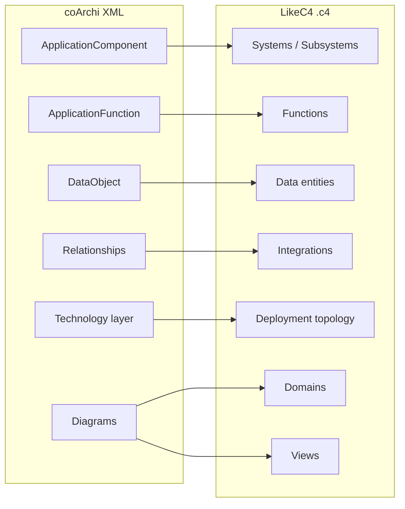
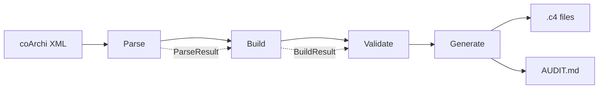

# archi2likec4

Конвертер из [coArchi](https://github.com/archimatetool/archi-modelrepository-plugin) XML в [LikeC4](https://likec4.dev/) architecture-as-code.

## Зачем

Архитектурная модель в Archi — это полноценная база знаний: системы, интеграции, deployment, метаданные. Но доступ к ней — только через десктопное приложение. Нельзя дать ссылку коллеге, нельзя встроить в CI, нельзя навигировать в браузере.

**archi2likec4** выгружает эту модель в [LikeC4](https://likec4.dev/) — code-first инструмент, где архитектура описывается текстовыми `.c4` файлами, версионируется в Git и рендерится как интерактивный портал прямо в браузере.

Результат: вся архитектурная информация из Archi становится доступна любому через `npx likec4 serve`, без установки Archi.

```bash
pip install archi2likec4
archi2likec4
cd output && npx likec4 serve
```

---

## Что конвертируется



- **Домены** — из иерархии диаграмм `functional_areas/`
- **Системы и подсистемы** — из `ApplicationComponent` (точка в имени = подсистема: `EFS.Core`)
- **Функции** — из `ApplicationFunction`, привязанные к родительской системе
- **Интеграции** — из Flow / Serving / Triggering relationships
- **Data-сущности** — из `DataObject` + `AccessRelationship`
- **Deployment** — полное дерево инфраструктуры из Technology-слоя
- **Solution views** — functional, integration, deployment из диаграмм Archi
- **AUDIT.md** — 10 категорий quality-инцидентов с рекомендациями по исправлению

На выходе ~200 `.c4` файлов, готовых к `likec4 serve`.

---

## CLI

```bash
archi2likec4 [MODEL_ROOT] [OUTPUT_DIR] [--config PATH] [--strict] [--verbose] [--dry-run]
```

По умолчанию: модель в `architectural_repository/model/`, выход в `output/`.
С `--strict` предупреждения quality gates становятся ошибками.
С `--dry-run` — только валидация, файлы не пишутся.

---

## Конфигурация

Всё опционально. Скопируйте `.archi2likec4.example.yaml` → `.archi2likec4.yaml`:

```yaml
promote_children:           # подсистемы → самостоятельные системы
  EFS: channels

domain_renames:             # переименование доменов из Archi
  banking_operations: [products, "Products"]

extra_domain_patterns:      # назначение домена по паттерну имени
  - c4_id: platform
    name: Platform
    patterns: [ELK, Grafana, Kubernetes]

quality_gates:
  max_unresolved_ratio: 0.5

audit_suppress: [LegacySystem]          # исключить из AUDIT.md
audit_suppress_incidents: [QA-6]        # подавить категорию целиком
domain_overrides: { AD: platform }      # ручное назначение домена
```

---

## Web UI

```bash
pip install "archi2likec4[web]"
archi2likec4 web
```

Дашборд на `localhost:8090`: метрики модели, 10 QA-инцидентов, one-click ремедиации (назначить домен, промоутить подсистему, подавить инцидент). Все решения — на странице `/remediations`. Тёмная тема, русский и английский язык.

---

## Quality Audit

Каждый запуск генерирует `AUDIT.md` — реестр инцидентов для владельцев ArchiMate-модели.

| | Что проверяется |
|---|---|
| **QA-1** Critical | Системы без домена |
| **QA-2** High | Пустые карточки (нет ни одного заполненного свойства) |
| **QA-3** High | Системы в папке `!РАЗБОР` |
| **QA-4** Medium | Кандидаты на декомпозицию (10+ подсистем) |
| **QA-5** Medium | Системы без documentation |
| **QA-6** Low | Осиротевшие функции |
| **QA-7** Critical | Нерезолвленные интеграции |
| **QA-8** High | Элементы solution views, не найденные в модели |
| **QA-9** Medium | Системы без deployment-маппинга |
| **QA-10** Medium | Проблемы иерархии развёртывания |

Пустые категории не отображаются. Подавленные — учитываются прозрачно.

---

## Как устроен конвертер



Четыре фазы, данные передаются через типизированные `NamedTuple`. Глобальное состояние изолировано между запусками.

```
archi2likec4/
  models.py       dataclasses: System, Integration, DeploymentNode…
  config.py       ConvertConfig, YAML-загрузка, валидация
  parsers.py      coArchi XML → dataclasses
  builders.py     сборка систем, доменов, интеграций, deployment
  generators.py   dataclasses → .c4 контент + AUDIT.md
  audit_data.py   compute_audit_incidents() — структурированные QA-данные
  i18n.py         каталог сообщений ru/en
  web.py          Flask UI (dashboard, ремедиации, иерархия)
  pipeline.py     main() — оркестрация
```

---

## Разработка

```bash
pip install -e ".[dev]"
python -m pytest tests/ -v   # 413+ тестов
```

Python >= 3.10. Базовая конвертация — zero dependencies (stdlib only).
Опционально: `[web]` — Flask + PyYAML (аудит-дашборд), `[federation]` — PyYAML (федерация).
YAML-конфиг (`.archi2likec4.yaml`) также требует PyYAML: `pip install pyyaml`.

[MIT](LICENSE) | [Contributing](CONTRIBUTING.md)
